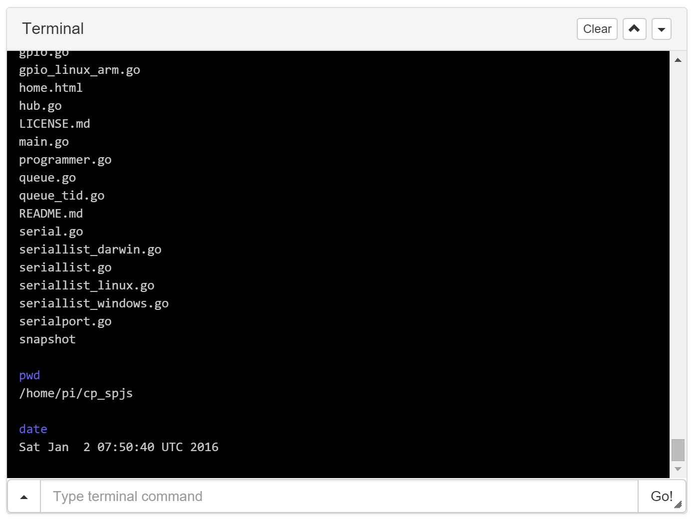

# com-chilipeppr-widget-terminal
A terminal session with the host running SPJS. As of version 1.87 of SPJS you can send/receive basic terminal commands to host operating system. This widget is a front-end UI for the terminal from ChiliPeppr.



## ChiliPeppr Widget / Terminal

All ChiliPeppr widgets/elements are defined using cpdefine() which is a method
that mimics require.js. Each defined object must have a unique ID so it does
not conflict with other ChiliPeppr widgets.

| Item                  | Value           |
| -------------         | ------------- | 
| ID                    | com-chilipeppr-widget-terminal |
| Name                  | Widget / Terminal |
| Description           | A terminal session with the host running SPJS. As of version 1.87 of SPJS you can send/receive basic terminal commands to host operating system. This widget is a front-end UI for the terminal from ChiliPeppr. |
| chilipeppr.load() URL | http://raw.githubusercontent.com/chilipeppr/widget-terminal/master/auto-generated-widget.html |
| Edit URL              | http://ide.c9.io/chilipeppr/widget-terminal |
| Github URL            | http://github.com/chilipeppr/widget-terminal |
| Test URL              | https://preview.c9users.io/chilipeppr/widget-terminal/widget.html |

## Example Code for chilipeppr.load() Statement

You can use the code below as a starting point for instantiating this widget 
inside a workspace or from another widget. The key is that you need to load 
your widget inlined into a div so the DOM can parse your HTML, CSS, and 
Javascript. Then you use cprequire() to find your widget's Javascript and get 
back the instance of it.

```javascript
// Inject new div to contain widget or use an existing div with an ID
$("body").append('<' + 'div id="myDivWidgetTerminal"><' + '/div>');

chilipeppr.load(
  "#myDivWidgetTerminal",
  "http://raw.githubusercontent.com/chilipeppr/widget-terminal/master/auto-generated-widget.html",
  function() {
    // Callback after widget loaded into #myDivWidgetTerminal
    // Now use require.js to get reference to instantiated widget
    cprequire(
      ["inline:com-chilipeppr-widget-terminal"], // the id you gave your widget
      function(myObjWidgetTerminal) {
        // Callback that is passed reference to the newly loaded widget
        console.log("Widget / Terminal just got loaded.", myObjWidgetTerminal);
        myObjWidgetTerminal.init();
      }
    );
  }
);

```

## Publish

This widget/element publishes the following signals. These signals are owned by this widget/element and are published to all objects inside the ChiliPeppr environment that listen to them via the 
chilipeppr.subscribe(signal, callback) method. 
To better understand how ChiliPeppr's subscribe() method works see amplify.js's documentation at http://amplifyjs.com/api/pubsub/

  <table id="com-chilipeppr-elem-pubsubviewer-pub" class="table table-bordered table-striped">
      <thead>
          <tr>
              <th style="">Signal</th>
              <th style="">Description</th>
          </tr>
      </thead>
      <tbody>
      <tr><td colspan="2">(No signals defined in this widget/element)</td></tr>    
      </tbody>
  </table>

## Subscribe

This widget/element subscribes to the following signals. These signals are owned by this widget/element. Other objects inside the ChiliPeppr environment can publish to these signals via the chilipeppr.publish(signal, data) method. 
To better understand how ChiliPeppr's publish() method works see amplify.js's documentation at http://amplifyjs.com/api/pubsub/

  <table id="com-chilipeppr-elem-pubsubviewer-sub" class="table table-bordered table-striped">
      <thead>
          <tr>
              <th style="">Signal</th>
              <th style="">Description</th>
          </tr>
      </thead>
      <tbody>
      <tr><td colspan="2">(No signals defined in this widget/element)</td></tr>    
      </tbody>
  </table>

## Foreign Publish

This widget/element publishes to the following signals that are owned by other objects. 
To better understand how ChiliPeppr's subscribe() method works see amplify.js's documentation at http://amplifyjs.com/api/pubsub/

  <table id="com-chilipeppr-elem-pubsubviewer-foreignpub" class="table table-bordered table-striped">
      <thead>
          <tr>
              <th style="">Signal</th>
              <th style="">Description</th>
          </tr>
      </thead>
      <tbody>
      <tr valign="top"><td>/com-chilipeppr-widget-terminal/com-chilipeppr-widget-serialport/ws/send</td><td>We send at a low-level on the socket the exec and execruntime command as a fundamental for this widget to work.</td></tr><tr valign="top"><td>/com-chilipeppr-widget-terminal/com-chilipeppr-widget-serialport/requestVersion</td><td>We need to ask the Serial Port JSON Server widget to send us back the version, we receive it back on the /recvVersion signal.</td></tr>    
      </tbody>
  </table>

## Foreign Subscribe

This widget/element publishes to the following signals that are owned by other objects.
To better understand how ChiliPeppr's publish() method works see amplify.js's documentation at http://amplifyjs.com/api/pubsub/

  <table id="com-chilipeppr-elem-pubsubviewer-foreignsub" class="table table-bordered table-striped">
      <thead>
          <tr>
              <th style="">Signal</th>
              <th style="">Description</th>
          </tr>
      </thead>
      <tbody>
      <tr valign="top"><td>/com-chilipeppr-widget-terminal/com-chilipeppr-widget-serialport/recvVersion</td><td>When we ask the Serial Port JSON Server widget to send us back the version from the /requestVersion signal, we receive it back on this signal.</td></tr>    
      </tbody>
  </table>

## Methods / Properties

The table below shows, in order, the methods and properties inside the widget/element.

  <table id="com-chilipeppr-elem-methodsprops" class="table table-bordered table-striped">
      <thead>
          <tr>
              <th style="">Method / Property</th>
              <th>Type</th>
              <th style="">Description</th>
          </tr>
      </thead>
      <tbody>
      <tr valign="top"><td>id</td><td>string</td><td>"com-chilipeppr-widget-terminal"<br><br>The ID of the widget. You must define this and make it unique.</td></tr><tr valign="top"><td>name</td><td>string</td><td>"Widget / Terminal"</td></tr><tr valign="top"><td>desc</td><td>string</td><td>"A terminal session with the host running SPJS. As of version 1.87 of SPJS you can send/receive basic terminal commands to host operating system. This widget is a front-end UI for the terminal from ChiliPeppr."</td></tr><tr valign="top"><td>url</td><td>string</td><td>"http://raw.githubusercontent.com/chilipeppr/widget-terminal/master/auto-generated-widget.html"</td></tr><tr valign="top"><td>fiddleurl</td><td>string</td><td>"http://ide.c9.io/chilipeppr/widget-terminal"</td></tr><tr valign="top"><td>githuburl</td><td>string</td><td>"http://github.com/chilipeppr/widget-terminal"</td></tr><tr valign="top"><td>testurl</td><td>string</td><td>"http://widget-terminal-chilipeppr.c9users.io/widget.html"</td></tr><tr valign="top"><td>publish</td><td>object</td><td>Please see docs above.<br><br>Define the publish signals that this widget/element owns or defines so that
other widgets know how to subscribe to them and what they do.</td></tr><tr valign="top"><td>subscribe</td><td>object</td><td>Please see docs above.<br><br>Define the subscribe signals that this widget/element owns or defines so that
other widgets know how to subscribe to them and what they do.</td></tr><tr valign="top"><td>foreignPublish</td><td>object</td><td>Please see docs above.<br><br>Document the foreign publish signals, i.e. signals owned by other widgets
or elements, that this widget/element publishes to.</td></tr><tr valign="top"><td>foreignSubscribe</td><td>object</td><td>Please see docs above.<br><br>Document the foreign subscribe signals, i.e. signals owned by other widgets
or elements, that this widget/element subscribes to.</td></tr><tr valign="top"><td>init</td><td>function</td><td>function () <br><br>All widgets should have an init method. It should be run by the
instantiating code like a workspace or a different widget.</td></tr><tr valign="top"><td>activate</td><td>function</td><td>function () </td></tr><tr valign="top"><td>deactivate</td><td>function</td><td>function () </td></tr><tr valign="top"><td>isInRaspiCheckMode</td><td>boolean</td><td></td></tr><tr valign="top"><td>raspiCapture</td><td>string</td><td></td></tr><tr valign="top"><td>checkIfRaspberryPi</td><td>function</td><td>function () </td></tr><tr valign="top"><td>checkIfRaspberryPiCallback</td><td>function</td><td>function (payload) </td></tr><tr valign="top"><td>execruntime</td><td>object</td><td></td></tr><tr valign="top"><td>onExecRuntimeStatus</td><td>function</td><td>function (json) </td></tr><tr valign="top"><td>sendExecRuntime</td><td>function</td><td>function () </td></tr><tr valign="top"><td>send</td><td>function</td><td>function (cmd) </td></tr><tr valign="top"><td>askForPwd</td><td>function</td><td>function () </td></tr><tr valign="top"><td>consoleSubscribeToLowLevelSerial</td><td>function</td><td>function () </td></tr><tr valign="top"><td>onWsRecv</td><td>function</td><td>function (msg) </td></tr><tr valign="top"><td>setupClearBtn</td><td>function</td><td>function () </td></tr><tr valign="top"><td>onClear</td><td>function</td><td>function (evt) </td></tr><tr valign="top"><td>onRecvLine</td><td>function</td><td>function (data) </td></tr><tr valign="top"><td>onEchoOfSend</td><td>function</td><td>function (data) </td></tr><tr valign="top"><td>appendLogEchoCmd</td><td>function</td><td>function (msg) </td></tr><tr valign="top"><td>logSetup</td><td>function</td><td>function () </td></tr><tr valign="top"><td>logEls</td><td>object</td><td></td></tr><tr valign="top"><td>appendLog</td><td>function</td><td>function (msg) </td></tr><tr valign="top"><td>history</td><td>object</td><td></td></tr><tr valign="top"><td>historyLastShownIndex</td><td>object</td><td></td></tr><tr valign="top"><td>pushOntoHistory</td><td>function</td><td>function (cmd) </td></tr><tr valign="top"><td>onHistoryMenuClick</td><td>function</td><td>function (evt) </td></tr><tr valign="top"><td>consoleSetup</td><td>function</td><td>function () </td></tr><tr valign="top"><td>setupResizeable</td><td>function</td><td>function () </td></tr><tr valign="top"><td>loadJqueryUi</td><td>function</td><td>function () </td></tr><tr valign="top"><td>resize</td><td>function</td><td>function () </td></tr><tr valign="top"><td>resizerSetup</td><td>function</td><td>function () </td></tr><tr valign="top"><td>isVersionWarningInitted</td><td>boolean</td><td></td></tr><tr valign="top"><td>ptrTimeout</td><td>object</td><td></td></tr><tr valign="top"><td>versionWarning</td><td>function</td><td>function () </td></tr><tr valign="top"><td>versionWarningCallback</td><td>function</td><td>function (spjsVersion) </td></tr><tr valign="top"><td>onTimeoutFromVersionRequest</td><td>function</td><td>function () </td></tr><tr valign="top"><td>isSpjsStatusWarningInitted</td><td>boolean</td><td></td></tr><tr valign="top"><td>requestSpjsStatus</td><td>function</td><td>function () </td></tr><tr valign="top"><td>onRequestSpjsStatusCallback</td><td>function</td><td>function (payload) </td></tr><tr valign="top"><td>btnSetup</td><td>function</td><td>function () <br><br>Call this method from init to setup all the buttons when this widget
is first loaded. This basically attaches click events to your 
buttons. It also turns on all the bootstrap popovers by scanning
the entire DOM of the widget.</td></tr><tr valign="top"><td>options</td><td>object</td><td>User options are available in this property for reference by your
methods. If any change is made on these options, please call
saveOptionsLocalStorage()</td></tr><tr valign="top"><td>setupUiFromLocalStorage</td><td>function</td><td>function () <br><br>Call this method on init to setup the UI by reading the user's
stored settings from localStorage and then adjust the UI to reflect
what the user wants.</td></tr><tr valign="top"><td>saveOptionsLocalStorage</td><td>function</td><td>function () <br><br>When a user changes a value that is stored as an option setting, you
should call this method immediately so that on next load the value
is correctly set.</td></tr><tr valign="top"><td>showBody</td><td>function</td><td>function (evt) <br><br>Show the body of the panel.
<br><br><b>evt</b> ({jquery_event})  - If you pass the event parameter in, we 
know it was clicked by the user and thus we store it for the next 
load so we can reset the user's preference. If you don't pass this 
value in we don't store the preference because it was likely code 
that sent in the param.</td></tr><tr valign="top"><td>hideBody</td><td>function</td><td>function (evt) <br><br>Hide the body of the panel.
<br><br><b>evt</b> ({jquery_event})  - If you pass the event parameter in, we 
know it was clicked by the user and thus we store it for the next 
load so we can reset the user's preference. If you don't pass this 
value in we don't store the preference because it was likely code 
that sent in the param.</td></tr><tr valign="top"><td>forkSetup</td><td>function</td><td>function () <br><br>This method loads the pubsubviewer widget which attaches to our 
upper right corner triangle menu and generates 3 menu items like
Pubsub Viewer, View Standalone, and Fork Widget. It also enables
the modal dialog that shows the documentation for this widget.<br><br>By using chilipeppr.load() we can ensure that the pubsubviewer widget
is only loaded and inlined once into the final ChiliPeppr workspace.
We are given back a reference to the instantiated singleton so its
not instantiated more than once. Then we call it's attachTo method
which creates the full pulldown menu for us and attaches the click
events.</td></tr>
      </tbody>
  </table>


## About ChiliPeppr

[ChiliPeppr](http://chilipeppr.com) is a hardware fiddle, meaning it is a 
website that lets you easily
create a workspace to fiddle with your hardware from software. ChiliPeppr provides
a [Serial Port JSON Server](https://github.com/johnlauer/serial-port-json-server) 
that you run locally on your computer, or remotely on another computer, to connect to 
the serial port of your hardware like an Arduino or other microcontroller.

You then create a workspace at ChiliPeppr.com that connects to your hardware 
by starting from scratch or forking somebody else's
workspace that is close to what you are after. Then you write widgets in
Javascript that interact with your hardware by forking the base template 
widget or forking another widget that
is similar to what you are trying to build.

ChiliPeppr is massively capable such that the workspaces for 
[TinyG](http://chilipeppr.com/tinyg) and [Grbl](http://chilipeppr.com/grbl) CNC 
controllers have become full-fledged CNC machine management software used by
tens of thousands.

ChiliPeppr has inspired many people in the hardware/software world to use the
browser and Javascript as the foundation for interacting with hardware. The
Arduino team in Italy caught wind of ChiliPeppr and now
ChiliPeppr's Serial Port JSON Server is the basis for the 
[Arduino's new web IDE](https://create.arduino.cc/). If the Arduino team is excited about building on top
of ChiliPeppr, what
will you build on top of it?

